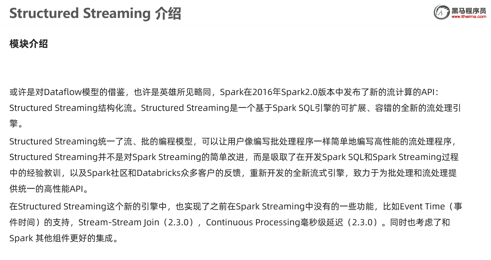
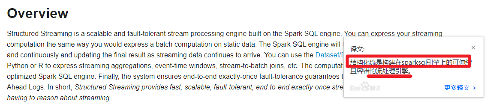
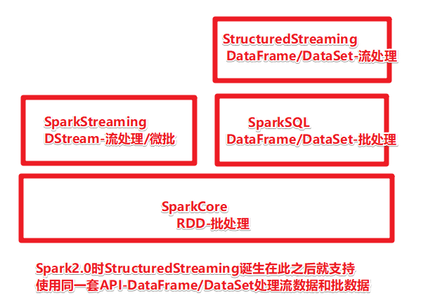
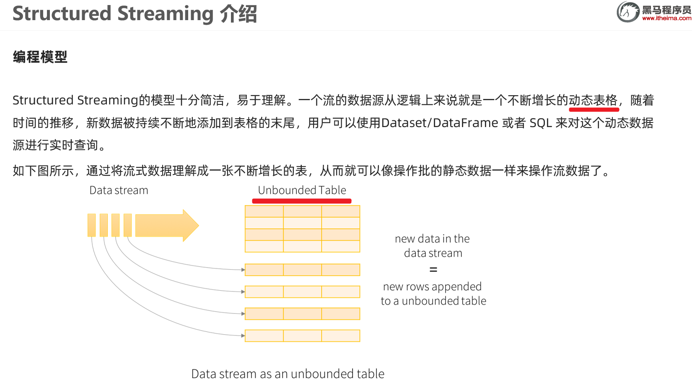
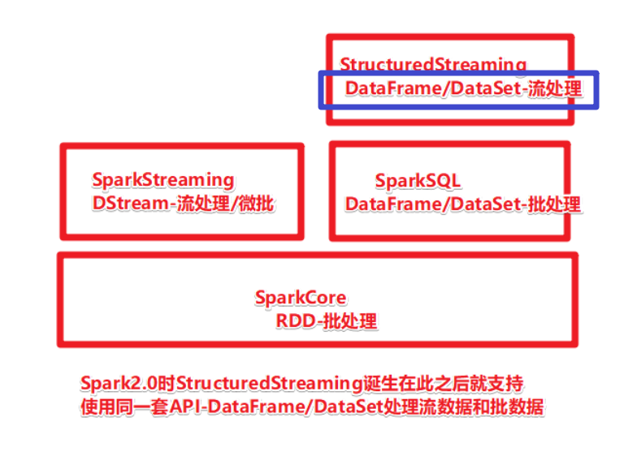
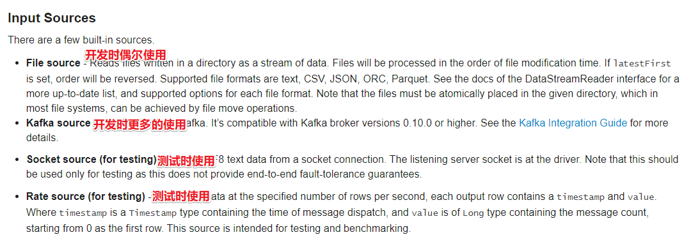
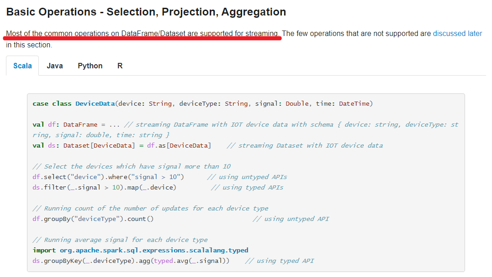
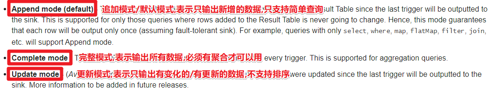
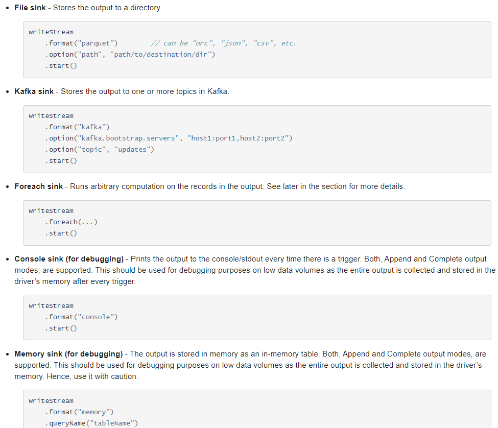
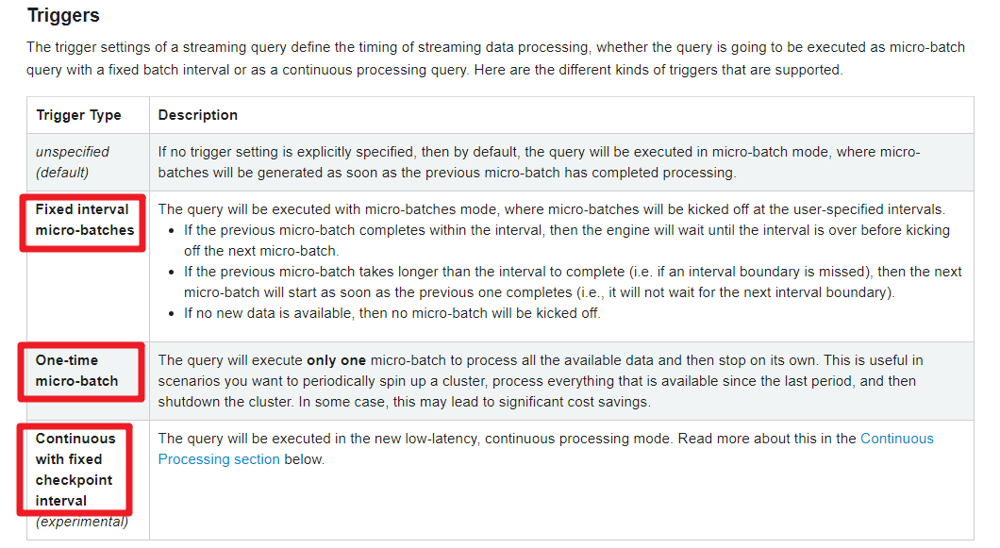

# StructuredStreaming & Spark综合案例

## 1、项目介绍
&emsp;&emsp;Spark 是一种基于内存的快速、通用、可扩展的大数据分析计算引擎。
  
&emsp;&emsp;本项目学习内容：
* StructuredStreaming详解
* StructuredStreaming整合Kafka
* Spark综合案例

&emsp;&emsp;本项目属于《Spark系列》：  
* [《Spark环境搭建》](https://github.com/xiaoguangbiao-github/bigdata_spark_env.git)  
* [《Spark内核原理及RDD》](https://github.com/xiaoguangbiao-github/bigdata_spark_core.git)  
* [《SparkStreaming & SparkSql》](https://github.com/xiaoguangbiao-github/bigdata_sparkstreaming_sparksql.git)  
* [《StructuredStreaming & Spark综合案例》](https://github.com/xiaoguangbiao-github/bigdata_structuredstreaming_sparkdemo.git)


## 2、开发环境

- 语言：scala 2.12.11

- Eclipse/IDEA

- 依赖管理：Maven

- Spark 3.0 + hadoop 2.7


# StructuredStreaming概述

## SparkStreaming的不足

1.基于微批,延迟高不能做到真正的实时

2.DStream基于RDD,不直接支持SQL

3.流批处理的API应用层不统一,(流用的DStream-底层是RDD,批用的DF/DS/RDD)

4.不支持EventTime事件时间

- 注: 
- EventTime事件时间 :事件真正发生的事件
- PorcessingTime处理时间:事件被流系统处理的时间
- IngestionTime摄入时间:事件到底流系统的时间
- 如: 一条错误日志10月1日,23:59:00秒产生的(事件时间),因为网路延迟,到10月2日 00:00:10到达日志处理系统(摄入时间),10月2日 00:00:20被流系统处理(处理时间)
- 如果要统计10月1日的系统bug数量,那么SparkStreaming不能正确统计,因为它不支持事件时间

5.数据的Exactly-Once(恰好一次语义)需要手动实现

- 注: 数据的一致性语义
- 最多一次
- 恰好一次--是我们的目标,SparkStreaming如果要实现恰好一次,需要手动维护偏移量+其他操作
- 最少一次


## StructuredStreaming介绍






http://spark.apache.org/docs/latest/structured-streaming-programming-guide.html





## 编程模型和数据抽象

编程模型 :无界表/动态表格

数据抽象: DataFrame/DataSet






# StructuredStreaming-Source

http://spark.apache.org/docs/latest/structured-streaming-programming-guide.html



## 代码演示-1-Socket

```java
package cn.xiaoguangbiao.structured

import org.apache.spark.SparkContext
import org.apache.spark.sql.{DataFrame, Dataset, Row, SparkSession}

/**
 * Author xiaoguangbiao
 * Desc 演示StructuredStreaming的Source-Socket
 */
object Demo01_Source_Socket {
  def main(args: Array[String]): Unit = {
    //TODO 0.创建环境
    //因为StructuredStreaming基于SparkSQL的且编程API/数据抽象是DataFrame/DataSet,所以这里创建SparkSession即可
    val spark: SparkSession = SparkSession.builder().appName("sparksql").master("local[*]")
      .config("spark.sql.shuffle.partitions", "4")//本次测试时将分区数设置小一点,实际开发中可以根据集群规模调整大小,默认200
      .getOrCreate()
    val sc: SparkContext = spark.sparkContext
    sc.setLogLevel("WARN")
    import spark.implicits._
    import org.apache.spark.sql.functions._

    //TODO 1.加载数据
    val df: DataFrame = spark.readStream
      .format("socket")
      .option("host", "node1")
      .option("port", 9999)
      .load()

    df.printSchema()
    /*
    root
     |-- value: string (nullable = true)
     */
    //df.show()// Queries with streaming sources must be executed with writeStream.start();

    //TODO 2.处理数据
    val ds: Dataset[String] = df.as[String]
    val result: Dataset[Row] = ds.flatMap(_.split(" "))
      .groupBy('value)
      .count()
      .orderBy('count.desc)

    //TODO 3.输出结果
    result.writeStream
        .format("console")
        .outputMode("complete")
    //TODO 4.启动并等待结束
        .start()
        .awaitTermination()

    //TODO 5.关闭资源
    spark.stop()
  }
}

```


## 代码演示-2-Rate

```java
package cn.xiaoguangbiao.structured

import org.apache.spark.SparkContext
import org.apache.spark.sql.{DataFrame, Dataset, Row, SparkSession}

/**
 * Author xiaoguangbiao
 * Desc 演示StructuredStreaming的Source-Rate
 */
object Demo02_Source_Rate {
  def main(args: Array[String]): Unit = {
    //TODO 0.创建环境
    //因为StructuredStreaming基于SparkSQL的且编程API/数据抽象是DataFrame/DataSet,所以这里创建SparkSession即可
    val spark: SparkSession = SparkSession.builder().appName("sparksql").master("local[*]")
      .config("spark.sql.shuffle.partitions", "4")//本次测试时将分区数设置小一点,实际开发中可以根据集群规模调整大小,默认200
      .getOrCreate()
    val sc: SparkContext = spark.sparkContext
    sc.setLogLevel("WARN")
    import spark.implicits._

    //TODO 1.加载数据
    val df: DataFrame = spark.readStream
      .format("rate")
      .option("rowsPerSecond", "10") //每秒生成数据条数
      .option("rampUpTime", "0s") //每条数据生成间隔时间
      .option("numPartitions", "2") //分区数目
      .load()


    //TODO 2.处理数据


    //TODO 3.输出结果
    df.writeStream
        .format("console")
        //Complete output mode not supported when there are no streaming aggregations
        //.outputMode("complete")
        .outputMode("append")
        .option("truncate",false)//表示对列不进行截断,也就是对列内容全部展示
    //TODO 4.启动并等待结束
        .start()
        .awaitTermination()

    //TODO 5.关闭资源
    spark.stop()
  }
}

```

## 代码演示-3-File

```java
package cn.xiaoguangbiao.structured

import org.apache.spark.SparkContext
import org.apache.spark.sql.types.{IntegerType, StringType, StructType}
import org.apache.spark.sql.{DataFrame, SparkSession}

/**
 * Author xiaoguangbiao
 * Desc 演示StructuredStreaming的Source-File
 */
object Demo03_Source_File {
  def main(args: Array[String]): Unit = {
    //TODO 0.创建环境
    //因为StructuredStreaming基于SparkSQL的且编程API/数据抽象是DataFrame/DataSet,所以这里创建SparkSession即可
    val spark: SparkSession = SparkSession.builder().appName("sparksql").master("local[*]")
      .config("spark.sql.shuffle.partitions", "4")//本次测试时将分区数设置小一点,实际开发中可以根据集群规模调整大小,默认200
      .getOrCreate()
    val sc: SparkContext = spark.sparkContext
    sc.setLogLevel("WARN")

    val csvSchema: StructType = new StructType()
      .add("name", StringType, nullable = true)
      .add("age", IntegerType, nullable = true)
      .add("hobby", StringType, nullable = true)


    //TODO 1.加载数据
    val df: DataFrame = spark.readStream
      .option("sep", ";")
      .option("header", "false")
      .schema(csvSchema)//注意:流式处理对于结构化数据哪怕是有约束也需要单独指定
      .format("csv").load("data/input/persons") //.csv("data/input/persons")

    //TODO 2.处理数据


    //TODO 3.输出结果
    df.writeStream
        .format("console")
        //Complete output mode not supported when there are no streaming aggregations
        //.outputMode("complete")
        .outputMode("append")
        .option("truncate",false)//表示对列不进行截断,也就是对列内容全部展示
    //TODO 4.启动并等待结束
        .start()
        .awaitTermination()

    //TODO 5.关闭资源
    spark.stop()
  }
}

```


# StructuredStreaming-Operation



```java
package cn.xiaoguangbiao.structured

import org.apache.spark.SparkContext
import org.apache.spark.sql.{DataFrame, Dataset, Row, SparkSession}

/**
 * Author xiaoguangbiao
 * Desc 演示StructuredStreaming的Operation
 */
object Demo04_Operation {
  def main(args: Array[String]): Unit = {
    //TODO 0.创建环境
    //因为StructuredStreaming基于SparkSQL的且编程API/数据抽象是DataFrame/DataSet,所以这里创建SparkSession即可
    val spark: SparkSession = SparkSession.builder().appName("sparksql").master("local[*]")
      .config("spark.sql.shuffle.partitions", "4")//本次测试时将分区数设置小一点,实际开发中可以根据集群规模调整大小,默认200
      .getOrCreate()
    val sc: SparkContext = spark.sparkContext
    sc.setLogLevel("WARN")
    import spark.implicits._

    //TODO 1.加载数据
    val df: DataFrame = spark.readStream
      .format("socket")
      .option("host", "node1")
      .option("port", 9999)
      .load()

    df.printSchema()
    /*
    root
     |-- value: string (nullable = true)
     */
    //df.show()// Queries with streaming sources must be executed with writeStream.start();

    //TODO 2.处理数据
    //TODO ====DSL
    val ds: Dataset[String] = df.as[String]
    val wordsDS: Dataset[String] = ds.flatMap(_.split(" "))
    val result1: Dataset[Row] = wordsDS
      .groupBy('value)
      .count()
      .orderBy('count.desc)


    //TODO ====SQL
    wordsDS.createOrReplaceTempView("t_words")
    val sql:String =
      """
        |select value,count(*) as counts
        |from t_words
        |group by value
        |order by counts desc
        |""".stripMargin
    val result2: DataFrame = spark.sql(sql)

    //TODO 3.输出结果
    result1.writeStream
        .format("console")
        .outputMode("complete")
    //TODO 4.启动
        .start()
        //.awaitTermination()//注意:后面还有代码要执行,所以这里需要注释掉

    result2.writeStream
      .format("console")
      .outputMode("complete")
      //TODO 4.启动并等待结束
      .start()
      .awaitTermination()

    //TODO 5.关闭资源
    spark.stop()
  }
}

```

# StructuredStreaming-Sink

## Output Modes



```java
package cn.xiaoguangbiao.structured

import org.apache.spark.SparkContext
import org.apache.spark.sql.{DataFrame, Dataset, Row, SparkSession}

/**
 * Author xiaoguangbiao
 * Desc 演示StructuredStreaming的Sink_OutPutMode
 */
object Demo05_Sink_OutPutMode {
  def main(args: Array[String]): Unit = {
    //TODO 0.创建环境
    //因为StructuredStreaming基于SparkSQL的且编程API/数据抽象是DataFrame/DataSet,所以这里创建SparkSession即可
    val spark: SparkSession = SparkSession.builder().appName("sparksql").master("local[*]")
      .config("spark.sql.shuffle.partitions", "4")//本次测试时将分区数设置小一点,实际开发中可以根据集群规模调整大小,默认200
      .getOrCreate()
    val sc: SparkContext = spark.sparkContext
    sc.setLogLevel("WARN")
    import spark.implicits._

    //TODO 1.加载数据
    val df: DataFrame = spark.readStream
      .format("socket")
      .option("host", "node1")
      .option("port", 9999)
      .load()

    df.printSchema()

    //TODO 2.处理数据
    val ds: Dataset[String] = df.as[String]
    val result1: Dataset[Row] = ds.flatMap(_.split(" "))
      .groupBy('value)
      .count()
      .orderBy('count.desc)

    val result2: Dataset[Row] = ds.flatMap(_.split(" "))
      .groupBy('value)
      .count()

    val result3: Dataset[String] = ds.flatMap(_.split(" "))


    //TODO 3.输出结果
    /*result1.writeStream
        .format("console")
        //.outputMode("append")//Append output mode not supported
        //.outputMode("update")//Sorting is not supported
      .outputMode("complete")
      .start()
      .awaitTermination()*/

    /*result2.writeStream
      .format("console")
      .outputMode("update")
      .start()
      .awaitTermination()*/

    result3.writeStream
      .format("console")
      .outputMode("append")
      //TODO 4.启动并等待结束
      .start()
      .awaitTermination()

    //TODO 5.关闭资源
    spark.stop()
  }
}

```

## Sink位置



```java
package cn.xiaoguangbiao.structured

import org.apache.spark.SparkContext
import org.apache.spark.sql.streaming.StreamingQuery
import org.apache.spark.sql.{DataFrame, Dataset, Row, SparkSession}

/**
 * Author xiaoguangbiao
 * Desc 演示StructuredStreaming的Sink_Location
 */
object Demo06_Sink_Location {
  def main(args: Array[String]): Unit = {
    //TODO 0.创建环境
    //因为StructuredStreaming基于SparkSQL的且编程API/数据抽象是DataFrame/DataSet,所以这里创建SparkSession即可
    val spark: SparkSession = SparkSession.builder().appName("sparksql").master("local[*]")
      .config("spark.sql.shuffle.partitions", "4")//本次测试时将分区数设置小一点,实际开发中可以根据集群规模调整大小,默认200
      .getOrCreate()
    val sc: SparkContext = spark.sparkContext
    sc.setLogLevel("WARN")
    import spark.implicits._

    //TODO 1.加载数据
    val df: DataFrame = spark.readStream
      .format("socket")
      .option("host", "node1")
      .option("port", 9999)
      .load()

    df.printSchema()

    //TODO 2.处理数据
    val ds: Dataset[String] = df.as[String]
    val result: Dataset[Row] = ds.flatMap(_.split(" "))
      .groupBy('value)
      .count()
      .orderBy('count.desc)

    //TODO 3.输出结果
    /*result.writeStream
        .format("console")
        .outputMode("complete")
        .start()
        .awaitTermination()*/

    val query: StreamingQuery = result.writeStream
      .format("memory")
      .queryName("t_result")
      .outputMode("complete")
      //TODO 4.启动并等待结束
      .start()
      //.awaitTermination()
    while(true){
      spark.sql("select * from t_result").show
      Thread.sleep(3000)
    }

    //query.awaitTermination()

    //TODO 5.关闭资源
    spark.stop()
  }
}
```

## ForeachBatch Sink

```java
package cn.xiaoguangbiao.structured

import org.apache.spark.SparkContext
import org.apache.spark.sql._

/**
 * Author xiaoguangbiao
 * Desc 演示StructuredStreaming的Sink_ForeachBatch
 */
object Demo07_Sink_ForeachBatch {
  def main(args: Array[String]): Unit = {
    //TODO 0.创建环境
    //因为StructuredStreaming基于SparkSQL的且编程API/数据抽象是DataFrame/DataSet,所以这里创建SparkSession即可
    val spark: SparkSession = SparkSession.builder().appName("sparksql").master("local[*]")
      .config("spark.sql.shuffle.partitions", "4") //本次测试时将分区数设置小一点,实际开发中可以根据集群规模调整大小,默认200
      .getOrCreate()
    val sc: SparkContext = spark.sparkContext
    sc.setLogLevel("WARN")
    import spark.implicits._

    //TODO 1.加载数据
    val df: DataFrame = spark.readStream
      .format("socket")
      .option("host", "node1")
      .option("port", 9999)
      .load()

    df.printSchema()

    //TODO 2.处理数据
    val ds: Dataset[String] = df.as[String]
    val result: Dataset[Row] = ds.flatMap(_.split(" "))
      .groupBy('value)
      .count()
      .orderBy('count.desc)

    //TODO 3.输出结果
    /*result.writeStream
        .format("console")
        .outputMode("complete")
        .start()
        .awaitTermination()*/
    result.writeStream
      .foreachBatch((ds: Dataset[Row], batchId:Long) => {
        //自定义输出到控制台
        println("-------------")
        println(s"batchId:${batchId}")
        println("-------------")
        ds.show()
        //自定义输出到MySQL
        ds.coalesce(1)
          .write
          .mode(SaveMode.Overwrite)
          .format("jdbc")
          //.option("driver", "com.mysql.cj.jdbc.Driver")//MySQL-8
          //.option("url", "jdbc:mysql://localhost:3306/?serverTimezone=UTC&characterEncoding=utf8&useUnicode=true")//MySQL-8
          .option("url", "jdbc:mysql://localhost:3306/bigdata?characterEncoding=UTF-8")
          .option("user", "root")
          .option("password", "root")
          .option("dbtable", "bigdata.t_struct_words")
          .save()
      })
      .outputMode("complete")
      //TODO 4.启动并等待结束
      .start()
      .awaitTermination()


    //TODO 5.关闭资源
    spark.stop()
  }
}

```


## 触发间隔




注意:

微批处理的时候每个批次可以做Checkpoint,容错/保持状态

那么在做连续处理的时候也需要做Checkpoint,什么时候做?--需要指定时间

```java
package cn.xiaoguangbiao.structured

import org.apache.spark.SparkContext
import org.apache.spark.sql.streaming.Trigger
import org.apache.spark.sql.{DataFrame, Dataset, Row, SparkSession}

/**
 * Author xiaoguangbiao
 * Desc 演示StructuredStreaming的Source-Socket
 */
object Demo08_Sink_Trigger_Checkpoint {
  def main(args: Array[String]): Unit = {
    //TODO 0.创建环境
    //因为StructuredStreaming基于SparkSQL的且编程API/数据抽象是DataFrame/DataSet,所以这里创建SparkSession即可
    val spark: SparkSession = SparkSession.builder().appName("sparksql").master("local[*]")
      .config("spark.sql.shuffle.partitions", "4")//本次测试时将分区数设置小一点,实际开发中可以根据集群规模调整大小,默认200
      .getOrCreate()
    val sc: SparkContext = spark.sparkContext
    sc.setLogLevel("WARN")
    import spark.implicits._

    //TODO 1.加载数据
    val df: DataFrame = spark.readStream
      .format("socket")
      .option("host", "node1")
      .option("port", 9999)
      .load()

    df.printSchema()

    //TODO 2.处理数据
    val ds: Dataset[String] = df.as[String]
    val result: Dataset[Row] = ds.coalesce(1).flatMap(_.split(" "))
      .groupBy('value)
      .count()
      //.orderBy('count.desc)

    //TODO 3.输出结果
    result.writeStream
        .format("console")
        .outputMode("complete")
        //触发间隔:
        //1.默认的不写就是:尽可能快的运行微批,Default trigger (runs micro-batch as soon as it can)
        //2.指定0也是尽可能快的运行
        // .trigger(Trigger.ProcessingTime("0 seconds"))
        //3.指定时间间隔
        //.trigger(Trigger.ProcessingTime("5 seconds"))
        //4.触发1次
        //.trigger(Trigger.Once())
        //5.连续处理并指定Checkpoint时间间隔,实验的
        .trigger(Trigger.Continuous("1 second"))
        .option("checkpointLocation", "./ckp"+System.currentTimeMillis())
    //TODO 4.启动并等待结束
        .start()
        .awaitTermination()

    //TODO 5.关闭资源
    spark.stop()
  }
}

```
