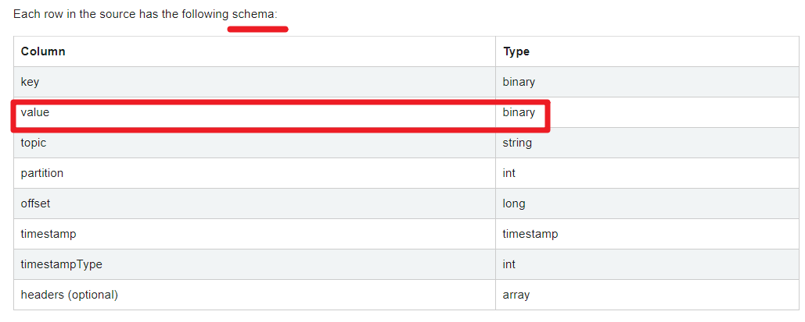
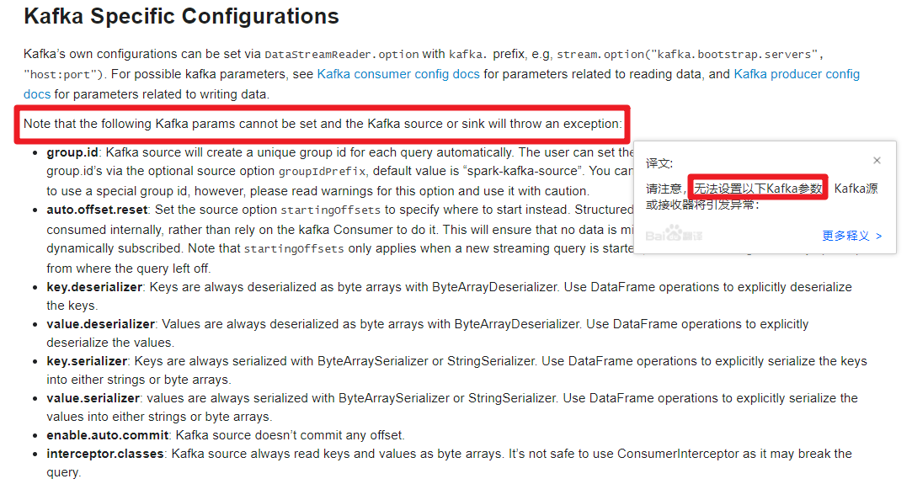
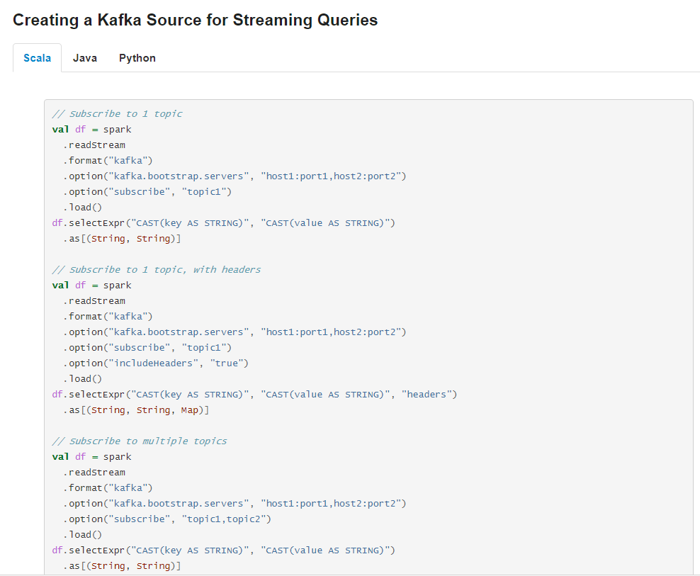
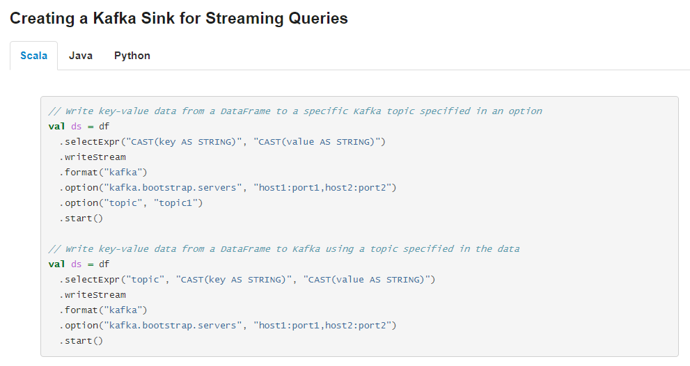
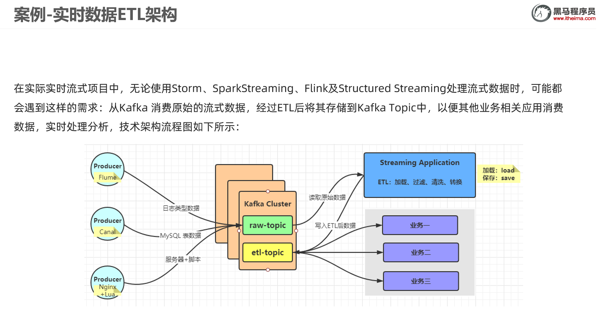
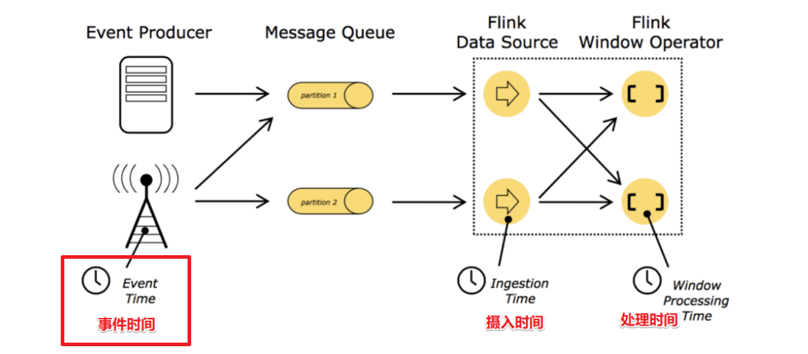
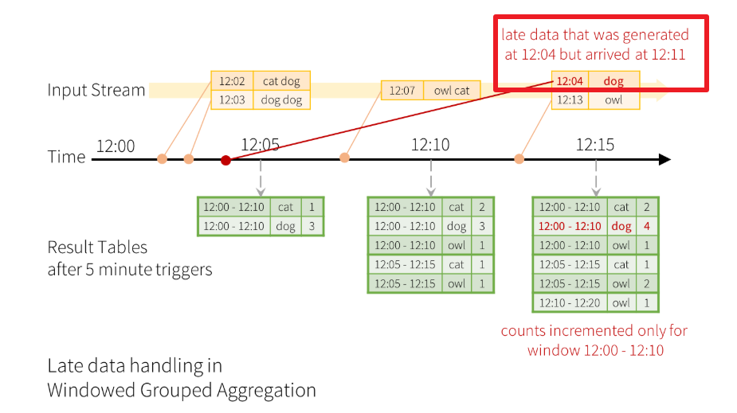

# StructuredStreaming整合Kafka

## 官网说明

http://spark.apache.org/docs/latest/structured-streaming-kafka-integration.html







## API使用







## 案例1-实时ETL

### 需求



### 准备数据-直接用

```java
package cn.xiaoguangbiao.structured

import java.util.Properties

import org.apache.kafka.clients.producer.{KafkaProducer, ProducerRecord}
import org.apache.kafka.common.serialization.StringSerializer

import scala.util.Random

/**
 * 模拟产生基站日志数据，实时发送Kafka Topic中
 * 数据字段信息：
 * 基站标识符ID, 主叫号码, 被叫号码, 通话状态, 通话时间，通话时长
 */
object MockStationLog {
  def main(args: Array[String]): Unit = {
    // 发送Kafka Topic
    val props = new Properties()
    props.put("bootstrap.servers", "node1:9092")
    props.put("acks", "1")
    props.put("retries", "3")
    props.put("key.serializer", classOf[StringSerializer].getName)
    props.put("value.serializer", classOf[StringSerializer].getName)
    val producer = new KafkaProducer[String, String](props)

    val random = new Random()
    val allStatus = Array(
      "fail", "busy", "barring", "success", "success", "success",
      "success", "success", "success", "success", "success", "success"
    )

    while (true) {
      val callOut: String = "1860000%04d".format(random.nextInt(10000))
      val callIn: String = "1890000%04d".format(random.nextInt(10000))
      val callStatus: String = allStatus(random.nextInt(allStatus.length))
      val callDuration = if ("success".equals(callStatus)) (1 + random.nextInt(10)) * 1000L else 0L

      // 随机产生一条基站日志数据
      val stationLog: StationLog = StationLog(
        "station_" + random.nextInt(10),
        callOut,
        callIn,
        callStatus,
        System.currentTimeMillis(),
        callDuration
      )
      println(stationLog.toString)
      Thread.sleep(100 + random.nextInt(100))

      val record = new ProducerRecord[String, String]("stationTopic", stationLog.toString)
      producer.send(record)
    }

    producer.close() // 关闭连接
  }

  /**
   * 基站通话日志数据
   */
  case class StationLog(
                         stationId: String, //基站标识符ID
                         callOut: String, //主叫号码
                         callIn: String, //被叫号码
                         callStatus: String, //通话状态
                         callTime: Long, //通话时间
                         duration: Long //通话时长
                       ) {
    override def toString: String = {
      s"$stationId,$callOut,$callIn,$callStatus,$callTime,$duration"
    }
  }

}
```


### 准备主题

```
#查看topic信息
/export/server/kafka/bin/kafka-topics.sh --list --zookeeper node1:2181
#删除topic
/export/server/kafka/bin/kafka-topics.sh --delete --zookeeper node1:2181 --topic stationTopic
/export/server/kafka/bin/kafka-topics.sh --delete --zookeeper node1:2181 --topic etlTopic

#创建topic
/export/server/kafka/bin/kafka-topics.sh --create --zookeeper node1:2181 --replication-factor 1 --partitions 3 --topic stationTopic
/export/server/kafka/bin/kafka-topics.sh --create --zookeeper node1:2181 --replication-factor 1 --partitions 3 --topic etlTopic

#模拟生产者
/export/server/kafka/bin/kafka-console-producer.sh --broker-list node1:9092 --topic stationTopic
/export/server/kafka/bin/kafka-console-producer.sh --broker-list node1:9092 --topic etlTopic

#模拟消费者
/export/server/kafka/bin/kafka-console-consumer.sh --bootstrap-server node1:9092 --topic stationTopic --from-beginning
/export/server/kafka/bin/kafka-console-consumer.sh --bootstrap-server node1:9092 --topic etlTopic --from-beginning
```


### 代码实现

stationTopic -->StructuredStreaming-->etlTopic

```java
package cn.xiaoguangbiao.structured

import org.apache.spark.SparkContext
import org.apache.spark.sql.streaming.Trigger
import org.apache.spark.sql.{DataFrame, Dataset, Row, SparkSession}

/**
 * Author xiaoguangbiao
 * Desc 演示StructuredStreaming整合Kafka,
 * 从stationTopic消费数据 -->使用StructuredStreaming进行ETL-->将ETL的结果写入到etlTopic
 */
object Demo09_Kafka_ETL {
  def main(args: Array[String]): Unit = {
    //TODO 0.创建环境
    //因为StructuredStreaming基于SparkSQL的且编程API/数据抽象是DataFrame/DataSet,所以这里创建SparkSession即可
    val spark: SparkSession = SparkSession.builder().appName("sparksql").master("local[*]")
      .config("spark.sql.shuffle.partitions", "4") //本次测试时将分区数设置小一点,实际开发中可以根据集群规模调整大小,默认200
      .getOrCreate()
    val sc: SparkContext = spark.sparkContext
    sc.setLogLevel("WARN")
    import spark.implicits._

    //TODO 1.加载数据-kafka-stationTopic
    val kafkaDF: DataFrame = spark.readStream
      .format("kafka")
      .option("kafka.bootstrap.servers", "node1:9092")
      .option("subscribe", "stationTopic")
      .load()
    val valueDS: Dataset[String] = kafkaDF.selectExpr("CAST(value AS STRING)").as[String]

    //TODO 2.处理数据-ETL-过滤出success的数据
    val etlResult: Dataset[String] = valueDS.filter(_.contains("success"))

    //TODO 3.输出结果-kafka-etlTopic
    etlResult.writeStream
        .format("kafka")
        .option("kafka.bootstrap.servers", "node1:9092")
        .option("topic", "etlTopic")
        .option("checkpointLocation", "./ckp")
        //TODO 4.启动并等待结束
        .start()
        .awaitTermination()


    //TODO 5.关闭资源
    spark.stop()
  }
}
//0.kafka准备好
//1.启动数据模拟程序
//2.启动控制台消费者方便观察
//3.启动Demo09_Kafka_ETL

```


## 案例2-物联网设备数据实时分析

### 需求


### 准备数据-直接用

```java
package cn.xiaoguangbiao.structured

import java.util.Properties

import org.apache.kafka.clients.producer.{KafkaProducer, ProducerRecord}
import org.apache.kafka.common.serialization.StringSerializer
import org.json4s.jackson.Json

import scala.util.Random

object MockIotDatas {
  def main(args: Array[String]): Unit = {
    // 发送Kafka Topic
    val props = new Properties()
    props.put("bootstrap.servers", "node1:9092")
    props.put("acks", "1")
    props.put("retries", "3")
    props.put("key.serializer", classOf[StringSerializer].getName)
    props.put("value.serializer", classOf[StringSerializer].getName)
    val producer = new KafkaProducer[String, String](props)

    val deviceTypes = Array(
      "db", "bigdata", "kafka", "route", "bigdata", "db", "bigdata", "bigdata", "bigdata"
    )

    val random: Random = new Random()
    while (true) {
      val index: Int = random.nextInt(deviceTypes.length)
      val deviceId: String = s"device_${(index + 1) * 10 + random.nextInt(index + 1)}"
      val deviceType: String = deviceTypes(index)
      val deviceSignal: Int = 10 + random.nextInt(90)
      // 模拟构造设备数据
      val deviceData = DeviceData(deviceId, deviceType, deviceSignal, System.currentTimeMillis())
      // 转换为JSON字符串
      val deviceJson: String = new Json(org.json4s.DefaultFormats).write(deviceData)
      println(deviceJson)
      Thread.sleep(100 + random.nextInt(500))

      val record = new ProducerRecord[String, String]("iotTopic", deviceJson)
      producer.send(record)
    }

    // 关闭连接
    producer.close()
  }

  /**
   * 物联网设备发送状态数据
   */
  case class DeviceData(
                         device: String, //设备标识符ID
                         deviceType: String, //设备类型，如服务器mysql, redis, kafka或路由器route
                         signal: Double, //设备信号
                         time: Long //发送数据时间
                       )

}
```


### 准备主题

```
#查看topic信息
/export/server/kafka/bin/kafka-topics.sh --list --zookeeper node1:2181
#删除topic
/export/server/kafka/bin/kafka-topics.sh --delete --zookeeper node1:2181 --topic iotTopic


#创建topic
/export/server/kafka/bin/kafka-topics.sh --create --zookeeper node1:2181 --replication-factor 1 --partitions 3 --topic iotTopic


#模拟消费者
/export/server/kafka/bin/kafka-console-consumer.sh --bootstrap-server node1:9092 --topic iotTopic --from-beginning

```


### 代码实现

iotTopic --->StructuredStreaming-->控制台

```java
package cn.xiaoguangbiao.structured

import org.apache.commons.lang3.StringUtils
import org.apache.spark.SparkContext
import org.apache.spark.sql.streaming.Trigger
import org.apache.spark.sql.types.DoubleType
import org.apache.spark.sql.{DataFrame, Dataset, SparkSession}

/**
 * Author xiaoguangbiao
 * Desc 演示StructuredStreaming整合Kafka,
 * 从iotTopic消费数据 -->使用StructuredStreaming进行实时分析-->将结果写到控制台
 */
object Demo10_Kafka_IOT {
  def main(args: Array[String]): Unit = {
    //TODO 0.创建环境
    //因为StructuredStreaming基于SparkSQL的且编程API/数据抽象是DataFrame/DataSet,所以这里创建SparkSession即可
    val spark: SparkSession = SparkSession.builder().appName("sparksql").master("local[*]")
      .config("spark.sql.shuffle.partitions", "4") //本次测试时将分区数设置小一点,实际开发中可以根据集群规模调整大小,默认200
      .getOrCreate()
    val sc: SparkContext = spark.sparkContext
    sc.setLogLevel("WARN")
    import spark.implicits._
    import org.apache.spark.sql.functions._

    //TODO 1.加载数据-kafka-iotTopic
    val kafkaDF: DataFrame = spark.readStream
      .format("kafka")
      .option("kafka.bootstrap.servers", "node1:9092")
      .option("subscribe", "iotTopic")
      .load()
    val valueDS: Dataset[String] = kafkaDF.selectExpr("CAST(value AS STRING)").as[String]
    //{"device":"device_30","deviceType":"kafka","signal":77.0,"time":1610158709534}

    //TODO 2.处理数据
    //需求:统计信号强度>30的各种设备类型对应的数量和平均信号强度
    //解析json(也就是增加schema:字段名和类型)
    //方式1:fastJson/Gson等工具包,后续案例中使用
    //方式2:使用SparkSQL的内置函数,当前案例使用
    val schemaDF: DataFrame = valueDS.filter(StringUtils.isNotBlank(_))
      .select(
        get_json_object($"value", "$.device").as("device_id"),
        get_json_object($"value", "$.deviceType").as("deviceType"),
        get_json_object($"value", "$.signal").cast(DoubleType).as("signal")
      )

    //需求:统计信号强度>30的各种设备类型对应的数量和平均信号强度
    //TODO ====SQL
    schemaDF.createOrReplaceTempView("t_iot")
    val sql: String =
      """
        |select deviceType,count(*) as counts,avg(signal) as avgsignal
        |from t_iot
        |where signal > 30
        |group by deviceType
        |""".stripMargin
    val result1: DataFrame = spark.sql(sql)

    //TODO ====DSL
    val result2: DataFrame = schemaDF.filter('signal > 30)
      .groupBy('deviceType)
      .agg(
        count('device_id) as "counts",
        avg('signal) as "avgsignal"
      )


    //TODO 3.输出结果-控制台
    result1.writeStream
      .format("console")
      .outputMode("complete")
      //.option("truncate", false)
      .start()
    //.awaitTermination()

    //TODO 4.启动并等待结束
    result2.writeStream
      .format("console")
      .outputMode("complete")
      //.trigger(Trigger.ProcessingTime(0))
      //.option("truncate", false)
      .start()
      .awaitTermination()

    //TODO 5.关闭资源
    spark.stop()
  }
}

//0.kafka准备好
//1.启动数据模拟程序
//2.启动Demo10_Kafka_IOT

```


# 基于事件时间的窗口计算

## 时间分类



注意: 在实际开发中一般都要基于事件时间进行窗口计算, 因为事件时间更能代表事件的本质

如: 10-1 23:59:50的订单, 到10-2 00:00:10才被系统处理,如果不支持事件时间那么会出现统计错误

而在StructuredStreaming中就支持事件时间


## API

- 基于事件时间进行窗口计算

```java
import spark.implicits._

val words = ... // streaming DataFrame of schema { timestamp: Timestamp, word: String }

// Group the data by window and word and compute the count of each group
val windowedCounts = words.groupBy(
  window($"timestamp", "10 minutes", "5 minutes"),
  $"word"
).count()
```


- 基于事件时间进行窗口计算-容易出现以下问题:

​      数据迟到--到底计算还是不计算?----得设置一个阈值! ---Watermaker水位线/水印




- 基于事件时间进行窗口计算+ Watermaker水位线/水印解决数据延迟到达问题

```java
import spark.implicits._

val words = ... // streaming DataFrame of schema { timestamp: Timestamp, word: String }

// Group the data by window and word and compute the count of each group
val windowedCounts = words
    .withWatermark("timestamp", "10 minutes")
    .groupBy(
        window($"timestamp", "10 minutes", "5 minutes"),
        $"word")
    .count()
```

## 需求

```
官网案例该开窗窗口长度为10 min，滑动间隔5 min，水印为eventtime-10 min，trigger为Trigger.ProcessingTime("5 minutes")，但是测试的时候用秒

每隔5s计算最近10s的数据,withWatermark设置为10s

2019-10-10 12:00:07,dog
2019-10-10 12:00:08,owl

2019-10-10 12:00:14,dog
2019-10-10 12:00:09,cat

2019-10-10 12:00:15,cat
2019-10-10 12:00:08,dog  --迟到不严重,会被计算,控制台会输出
2019-10-10 12:00:13,owl
2019-10-10 12:00:21,owl

2019-10-10 12:00:04,donkey  --迟到严重,不会被计算,控制台不会输出
2019-10-10 12:00:17,owl     --影响结果


```


## 代码演示

```java
package cn.xiaoguangbiao.structured

import java.sql.Timestamp

import org.apache.commons.lang3.StringUtils
import org.apache.spark.SparkContext
import org.apache.spark.sql.streaming.{OutputMode, StreamingQuery, Trigger}
import org.apache.spark.sql.types.DoubleType
import org.apache.spark.sql.{DataFrame, Dataset, SparkSession}

/**
 * Author xiaoguangbiao
 * Desc 演示StructuredStreaming
 * 基于事件时间的窗口计算+水位线/水印解决数据延迟到达(能够容忍一定程度上的延迟,迟到严重的还是会被丢弃)
 * 每隔5s计算最近10s的数据,withWatermark设置为10s
 *
 * 2019-10-10 12:00:07,dog
 * 2019-10-10 12:00:08,owl
 *
 * 2019-10-10 12:00:14,dog
 * 2019-10-10 12:00:09,cat
 *
 * 2019-10-10 12:00:15,cat
 * 2019-10-10 12:00:08,dog  --迟到不严重,会被计算,影响最后的统计结果
 * 2019-10-10 12:00:13,owl
 * 2019-10-10 12:00:21,owl
 *
 * 2019-10-10 12:00:04,donkey  --迟到严重,不会被计算,不影响最后的统计结果
 * 2019-10-10 12:00:17,owl     --影响结果
 */
object Demo11_Eventtime_Window_Watermark {
  def main(args: Array[String]): Unit = {
    //TODO 0.创建环境
    //因为StructuredStreaming基于SparkSQL的且编程API/数据抽象是DataFrame/DataSet,所以这里创建SparkSession即可
    val spark: SparkSession = SparkSession.builder().appName("sparksql").master("local[*]")
      .config("spark.sql.shuffle.partitions", "4") //本次测试时将分区数设置小一点,实际开发中可以根据集群规模调整大小,默认200
      .getOrCreate()
    val sc: SparkContext = spark.sparkContext
    sc.setLogLevel("WARN")
    import org.apache.spark.sql.functions._
    import spark.implicits._

    //TODO 1.加载数据
    val socketDF: DataFrame = spark.readStream
      .format("socket")
      .option("host", "node1")
      .option("port", 9999)
      .load()

    //TODO 2.处理数据:添加schema
    val wordDF = socketDF
      .as[String]
      .filter(StringUtils.isNotBlank(_))
      // 将每行数据进行分割: 2019-10-12 09:00:02,cat
      .map(line => {
        val arr = line.trim.split(",")
        val timestampStr: String = arr(0)
        val word: String = arr(1)
        (Timestamp.valueOf(timestampStr), word)
      })
      // 设置列的名称
      .toDF("timestamp", "word")
    //需求:每隔5s计算最近10s的数据,withWatermark设置为10s
    val resultDF = wordDF
      //withWatermark(指定事件时间是哪一列,指定时间阈值)
      .withWatermark("timestamp", "10 seconds")
      .groupBy(
        //指定基于事件时间做窗口聚合计算:WordCount
        //window(指定事件时间是哪一列,窗口长度,滑动间隔)
        window($"timestamp", "10 seconds", "5 seconds"),
        $"word")
      .count()


    //TODO 3.输出结果-控制台
    resultDF.writeStream
      .outputMode(OutputMode.Update()) //为了方便观察只输出有变化的数据
      .format("console")
      .option("truncate", "false")
      .trigger(Trigger.ProcessingTime("5 seconds"))
      //TODO 4.启动并等待结束
      .start()
      .awaitTermination()

    spark.stop()

    //TODO 5.关闭资源
    spark.stop()
  }
}

//0.kafka准备好
//1.启动数据模拟程序
//2.启动Demo10_Kafka_IOT

```


# 流数据去重

## 说明

Spark中的批数据去重很简单,直接对所有数据进行

```
df.dropDuplicates("列名1","列名2")
```

流式数据去重需要保存历史数据的状态才可以做的去重,而StructuredStreaming的状态管理是自动的

所以StructuredStreaming的流式数据去重和批处理一样

```
df.dropDuplicates("列名1","列名2")
```

## 需求

对网站用户日志数据，按照userId和eventTime、eventType去重统计
数据如下：

```
{"eventTime": "2016-01-10 10:01:50","eventType": "browse","userID":"1"}
{"eventTime": "2016-01-10 10:01:50","eventType": "click","userID":"1"}
{"eventTime": "2016-01-10 10:01:50","eventType": "click","userID":"1"}
{"eventTime": "2016-01-10 10:01:50","eventType": "slide","userID":"1"}
{"eventTime": "2016-01-10 10:01:50","eventType": "browse","userID":"1"}
{"eventTime": "2016-01-10 10:01:50","eventType": "click","userID":"1"}
{"eventTime": "2016-01-10 10:01:50","eventType": "slide","userID":"1"}
```


## 代码实现

```java
package cn.xiaoguangbiao.structured

import java.sql.Timestamp

import org.apache.commons.lang3.StringUtils
import org.apache.spark.SparkContext
import org.apache.spark.sql.streaming.{OutputMode, StreamingQuery, Trigger}
import org.apache.spark.sql.{DataFrame, Dataset, Row, SparkSession}

/**
 * Author xiaoguangbiao
 * Desc 演示StructuredStreaming
 */
object Demo12_Deduplication {
  def main(args: Array[String]): Unit = {
    //TODO 0.创建环境
    //因为StructuredStreaming基于SparkSQL的且编程API/数据抽象是DataFrame/DataSet,所以这里创建SparkSession即可
    val spark: SparkSession = SparkSession.builder().appName("sparksql").master("local[*]")
      .config("spark.sql.shuffle.partitions", "4") //本次测试时将分区数设置小一点,实际开发中可以根据集群规模调整大小,默认200
      .getOrCreate()
    val sc: SparkContext = spark.sparkContext
    sc.setLogLevel("WARN")
    import org.apache.spark.sql.functions._
    import spark.implicits._

    //TODO 1.加载数据
    val socketDF: DataFrame = spark.readStream
      .format("socket")
      .option("host", "node1")
      .option("port", 9999)
      .load()

    //TODO 2.处理数据:添加schema
    //{"eventTime": "2016-01-10 10:01:50","eventType": "browse","userID":"1"}
    //{"eventTime": "2016-01-10 10:01:50","eventType": "click","userID":"1"}
    val schemaDF: DataFrame = socketDF
      .as[String]
      .filter(StringUtils.isNotBlank(_))
      .select(
        get_json_object($"value", "$.eventTime").as("eventTime"),
        get_json_object($"value", "$.eventType").as("eventType"),
        get_json_object($"value", "$.userID").as("userID")
      )

    //TODO 3.数据处理
    //对网站用户日志数据，按照userId和eventTime、eventType去重统计
    val result: Dataset[Row] = schemaDF
      .dropDuplicates("userID","eventTime","eventType")
      .groupBy("userID")
      .count()


    result.writeStream
      .outputMode(OutputMode.Complete())
      .format("console")
      .start()
      .awaitTermination()

    //TODO 5.关闭资源
    spark.stop()
  }
}

//0.kafka准备好
//1.启动数据模拟程序
//2.启动Demo10_Kafka_IOT

```


